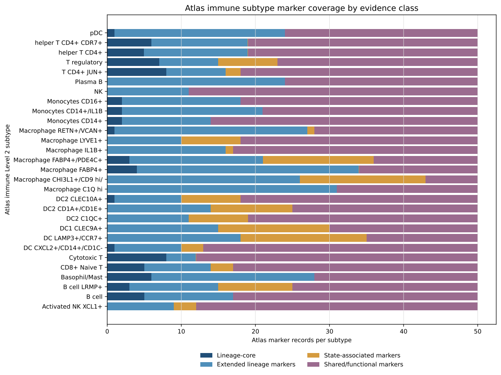
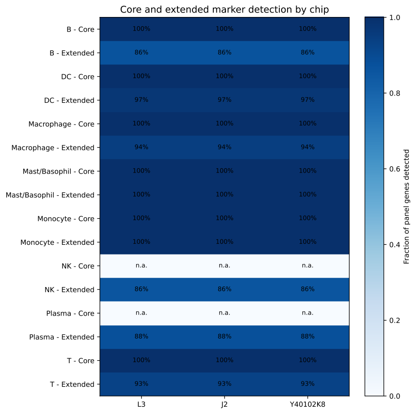
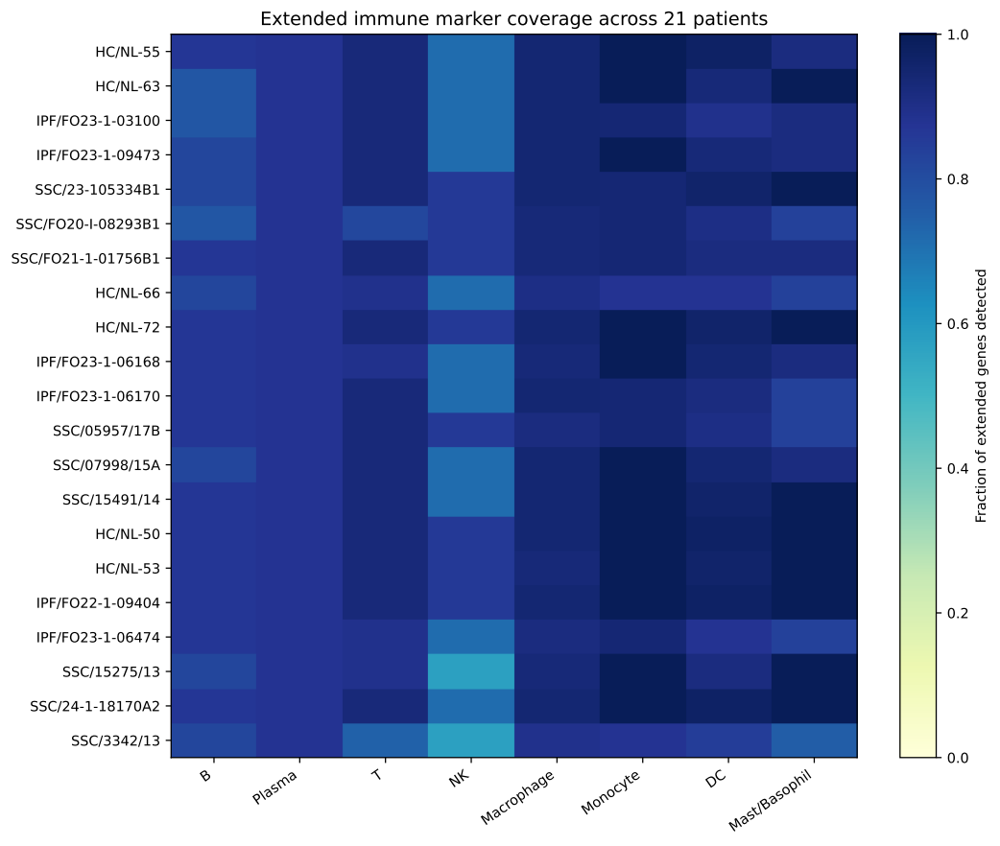
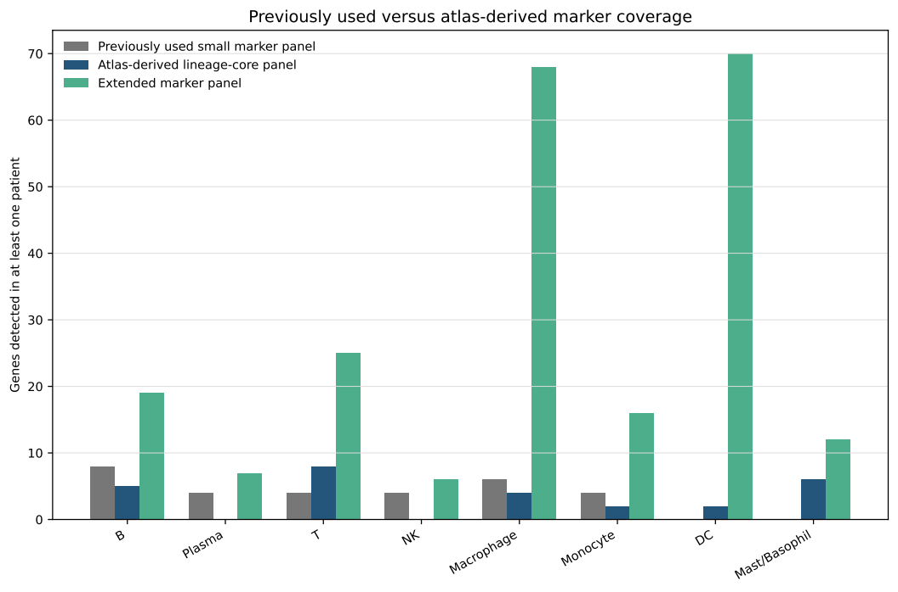
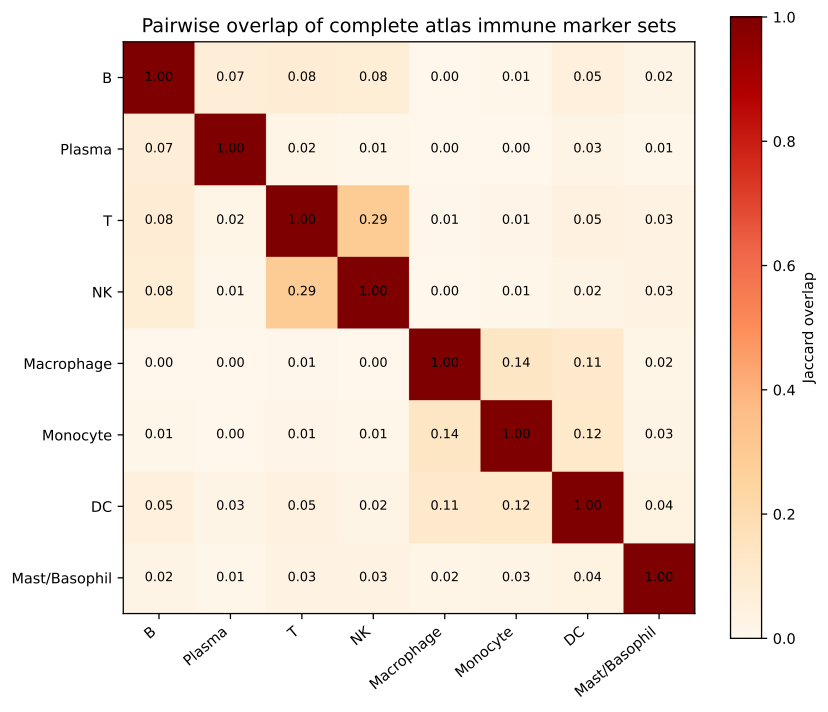

## Scope and approved analysis boundary

This report summarizes the approved atlas marker-library construction and whole-tissue Bin50 raw-count detectability audit. It does not rerun RCTD, clustering, neighborhood scoring, disease testing, DEG/GSEA, CellChat, or frozen aggregate analyses.

## Executive summary

- Immune atlas hierarchy: **9 Level 1** and **29 Level 2** categories.
- Immune marker library: **1,450 records** and **692 unique genes**.
- Candidate panels: **27 strict-core genes** and **209 eligible non-core genes**.
- Stereo-seq: **667 genes available** and **667 detected at least once**.
- Increased panel coverage is evidence of improved RNA detectability only; it does not establish improved immune-cell identification accuracy.

## Inputs and provenance

| absolute_path | file_name | size_bytes | modified_time | sha256 | analysis_purpose |
| --- | --- | --- | --- | --- | --- |
| D:\Lung ST\codex agent\stereo_seq\stereo_seq\results\reanalysis\bin50_input\BI_PF_ILD_atlas_marker_gene_table_260709213053.xlsx | BI_PF_ILD_atlas_marker_gene_table_260709213053.xlsx | 276307 | 2026-07-30T15:29:09.679694891+00:00 | b6c17a25dd9da4f73b108f3cf3b964397e787b6c08ba97208295f6c38f9c81b8 | Primary atlas marker input; read-only copy |
| D:\Lung ST\codex agent\stereo_seq\stereo_seq\results\visium way\06_hvg_audit\BI_PF_ILD_atlas_marker_gene_table_260709213053.xlsx | BI_PF_ILD_atlas_marker_gene_table_260709213053.xlsx | 276307 | 2026-09-24T17:56:43.758608580+00:00 | b6c17a25dd9da4f73b108f3cf3b964397e787b6c08ba97208295f6c38f9c81b8 | Primary atlas marker input; read-only copy |
| D:\Lung ST\codex agent\stereo_seq\stereo_seq\results\reanalysis\bin50_input\BIN50_joint_reanalysis_tissue_raw_counts_common_genes.h5ad | BIN50_joint_reanalysis_tissue_raw_counts_common_genes.h5ad | 142554745 | 2026-07-25T18:07:50.730975628+00:00 | 3a9da66830f9214c879c0b638920078245ec23ad370fcadb58c105ca3a7b88da | QCed 21-patient sparse Bin50 raw-count matrix |
| D:\Lung ST\codex agent\stereo_seq\stereo_seq\results\reanalysis\bin50_representation_benchmark\ensembl_gene_symbol_mapping.csv | ensembl_gene_symbol_mapping.csv | 1182576 | 2026-07-26T00:12:19.672169447+00:00 | 7cc6e477dc648ab242959fe7c831ba668eb120f7827750616d87769c005452e9 | Ensembl-to-gene-symbol mapping |
| D:\Lung ST\codex agent\stereo_seq\stereo_seq\scripts\1049_prepare_immune_subniche_validation.R | 1049_prepare_immune_subniche_validation.R | 19292 | 2026-10-09T13:47:27.281918049+00:00 | c7d44cd87c5a5e08012656f8f96a4bf9aa3aaf02cd6cec5b3deace23b5753992 | Source code defining the previously used small immune marker panels |

## Core versus extended coverage

| lineage | panel_gene_n: A. Previously used small marker panel | panel_gene_n: B. Atlas-derived lineage-core panel | panel_gene_n: C. Extended marker panel | detectable_gene_n: A. Previously used small marker panel | detectable_gene_n: B. Atlas-derived lineage-core panel | detectable_gene_n: C. Extended marker panel |
| --- | --- | --- | --- | --- | --- | --- |
| B | 8 | 5 | 22 | 8 | 5 | 19 |
| DC | 0 | 2 | 72 | 0 | 2 | 70 |
| Macrophage | 6 | 4 | 72 | 6 | 4 | 68 |
| Mast/Basophil | 0 | 6 | 12 | 0 | 6 | 12 |
| Monocyte | 4 | 2 | 16 | 4 | 2 | 16 |
| NK | 4 | 0 | 7 | 4 | 0 | 6 |
| Plasma | 4 | 0 | 8 | 4 | 0 | 7 |
| T | 4 | 8 | 27 | 4 | 8 | 25 |

## Signature detectability summary

| cell_lineage | signature_type | atlas_subtype_n | signature_genes | signature_gene_n | available_genes | unavailable_genes | available_gene_n | unavailable_gene_n | patients_with_any_detectable_gene | median_detectable_gene_n_per_patient | minimum_detectable_gene_n_per_patient | gene_patient_detection_fraction | followup_condition | accuracy_claim_allowed |
| --- | --- | --- | --- | --- | --- | --- | --- | --- | --- | --- | --- | --- | --- | --- |
| Activated NK | 1. Reference-based core signature | 1 | nan | 0 | nan | nan | 0 | 0 | 0 | 0.0 | 0 | nan | insufficient_stable_detection | False |
| Activated NK | 2. Extended exploratory signature | 1 | KLRB1;TXK;XCL1;XCL2 | 4 | KLRB1;TXK;XCL1 | XCL2 | 3 | 1 | 21 | 2.0 | 2 | 0.5952380952380952 | coverage_supports_reviewed_exploratory_followup | False |
| Activated NK | 3. Stereo-seq detectable subset | 1 | KLRB1;TXK;XCL1 | 3 | KLRB1;TXK;XCL1 | nan | 3 | 0 | 21 | 2.0 | 2 | 0.7936507936507936 | coverage_supports_reviewed_exploratory_followup | False |
| Alveolar/resident macrophage | 1. Reference-based core signature | 4 | FABP4;MARCO;MSR1;PPARG | 4 | FABP4;MARCO;MSR1;PPARG | nan | 4 | 0 | 21 | 4.0 | 4 | 1.0 | coverage_supports_reviewed_exploratory_followup | False |
| Alveolar/resident macrophage | 2. Extended exploratory signature | 4 | ABCA1;AC007192.4;ACP5;ALDH2;APOC1;APOE;BCAS4;CCSER1;CD163L1;CD52;CRIP1;CTSB;CTSC;CTSZ;DOCK4;DOCK8;EPB41L3;FABP4;FBP1;FMN1;FMNL2;FOLR2;FRMD4A;FTL;GLUL;GPNMB;GRN;HMOX1;LGMN;LYVE1;MARCO;MCEMP1;MS4A6E;MSR1;MT1G;OLR1;PAPSS2;PPARG;PSAP;RP11-20I23.1;RP11-295K3.1;SCHLAP1;SLC11A1;SLCO2B1;SNTB1;SNX10;TANC2;TREM1;VSIG4;XXbac-BPG181M17.5 | 50 | ABCA1;ACP5;ALDH2;APOC1;APOE;BCAS4;CCSER1;CD163L1;CD52;CRIP1;CTSB;CTSC;CTSZ;DOCK4;DOCK8;EPB41L3;FABP4;FBP1;FMN1;FMNL2;FOLR2;FRMD4A;FTL;GLUL;GPNMB;GRN;HMOX1;LGMN;LYVE1;MARCO;MCEMP1;MS4A6E;MSR1;MT1G;OLR1;PAPSS2;PPARG;PSAP;SCHLAP1;SLC11A1;SLCO2B1;SNTB1;SNX10;TANC2;TREM1;VSIG4 | AC007192.4;RP11-20I23.1;RP11-295K3.1;XXbac-BPG181M17.5 | 46 | 4 | 21 | 46.0 | 44 | 0.9114285714285716 | coverage_supports_reviewed_exploratory_followup | False |
| Alveolar/resident macrophage | 3. Stereo-seq detectable subset | 4 | ABCA1;ACP5;ALDH2;APOC1;APOE;BCAS4;CCSER1;CD163L1;CD52;CRIP1;CTSB;CTSC;CTSZ;DOCK4;DOCK8;EPB41L3;FABP4;FBP1;FMN1;FMNL2;FOLR2;FRMD4A;FTL;GLUL;GPNMB;GRN;HMOX1;LGMN;LYVE1;MARCO;MCEMP1;MS4A6E;MSR1;MT1G;OLR1;PAPSS2;PPARG;PSAP;SCHLAP1;SLC11A1;SLCO2B1;SNTB1;SNX10;TANC2;TREM1;VSIG4 | 46 | ABCA1;ACP5;ALDH2;APOC1;APOE;BCAS4;CCSER1;CD163L1;CD52;CRIP1;CTSB;CTSC;CTSZ;DOCK4;DOCK8;EPB41L3;FABP4;FBP1;FMN1;FMNL2;FOLR2;FRMD4A;FTL;GLUL;GPNMB;GRN;HMOX1;LGMN;LYVE1;MARCO;MCEMP1;MS4A6E;MSR1;MT1G;OLR1;PAPSS2;PPARG;PSAP;SCHLAP1;SLC11A1;SLCO2B1;SNTB1;SNX10;TANC2;TREM1;VSIG4 | nan | 46 | 0 | 21 | 46.0 | 44 | 0.9906832298136646 | coverage_supports_reviewed_exploratory_followup | False |
| B | 1. Reference-based core signature | 2 | BANK1;BLK;CD79B;MS4A1;TNFRSF13C | 5 | BANK1;BLK;CD79B;MS4A1;TNFRSF13C | nan | 5 | 0 | 21 | 5.0 | 3 | 0.8857142857142857 | coverage_supports_reviewed_exploratory_followup | False |
| B | 2. Extended exploratory signature | 2 | ARHGAP24;BANK1;BLK;CD22;CD79B;ITSN2;KIAA0922;LINC00926;LRMP;MAP4K4;MGAT5;MS4A1;NCOA3;NLK;PRDM2;RBM6;SAMD12;TCL1A;TNFRSF13C;USP34;VPREB3;ZCCHC7 | 22 | ARHGAP24;BANK1;BLK;CD22;CD79B;ITSN2;LINC00926;LRMP;MAP4K4;MGAT5;MS4A1;NCOA3;NLK;PRDM2;RBM6;SAMD12;TNFRSF13C;USP34;ZCCHC7 | KIAA0922;TCL1A;VPREB3 | 19 | 3 | 21 | 19.0 | 17 | 0.8376623376623377 | coverage_supports_reviewed_exploratory_followup | False |
| B | 3. Stereo-seq detectable subset | 2 | ARHGAP24;BANK1;BLK;CD22;CD79B;ITSN2;LINC00926;LRMP;MAP4K4;MGAT5;MS4A1;NCOA3;NLK;PRDM2;RBM6;SAMD12;TNFRSF13C;USP34;ZCCHC7 | 19 | ARHGAP24;BANK1;BLK;CD22;CD79B;ITSN2;LINC00926;LRMP;MAP4K4;MGAT5;MS4A1;NCOA3;NLK;PRDM2;RBM6;SAMD12;TNFRSF13C;USP34;ZCCHC7 | nan | 19 | 0 | 21 | 19.0 | 17 | 0.9699248120300752 | coverage_supports_reviewed_exploratory_followup | False |
| CD4 T | 1. Reference-based core signature | 3 | BCL11B;CD2;CD3D;CD3E;CD3G;ITK;TRAC;TRBC2 | 8 | BCL11B;CD2;CD3D;CD3E;CD3G;ITK;TRAC;TRBC2 | nan | 8 | 0 | 21 | 8.0 | 5 | 0.9642857142857144 | coverage_supports_reviewed_exploratory_followup | False |
| CD4 T | 2. Extended exploratory signature | 3 | ABCC1;AC016831.7;ADAM19;ATXN1;BCL11B;CAMK4;CD2;CD3D;CD3E;CD3G;FAM129A;FOXO1;ITK;PBX4;PDE3B;RNF19A;RP11-138A9.2;SPOCK2;THEMIS;TRAC;TRBC2 | 21 | ABCC1;AC016831.7;ADAM19;ATXN1;BCL11B;CAMK4;CD2;CD3D;CD3E;CD3G;FAM129A;FOXO1;ITK;PBX4;PDE3B;RNF19A;SPOCK2;THEMIS;TRAC;TRBC2 | RP11-138A9.2 | 20 | 1 | 21 | 20.0 | 17 | 0.9387755102040816 | coverage_supports_reviewed_exploratory_followup | False |
| CD4 T | 3. Stereo-seq detectable subset | 3 | ABCC1;AC016831.7;ADAM19;ATXN1;BCL11B;CAMK4;CD2;CD3D;CD3E;CD3G;FAM129A;FOXO1;ITK;PBX4;PDE3B;RNF19A;SPOCK2;THEMIS;TRAC;TRBC2 | 20 | ABCC1;AC016831.7;ADAM19;ATXN1;BCL11B;CAMK4;CD2;CD3D;CD3E;CD3G;FAM129A;FOXO1;ITK;PBX4;PDE3B;RNF19A;SPOCK2;THEMIS;TRAC;TRBC2 | nan | 20 | 0 | 21 | 20.0 | 17 | 0.9857142857142858 | coverage_supports_reviewed_exploratory_followup | False |
| CD8 T | 1. Reference-based core signature | 1 | CD2;CD3D;CD3E;ITK;TRAC | 5 | CD2;CD3D;CD3E;ITK;TRAC | nan | 5 | 0 | 21 | 5.0 | 3 | 0.9523809523809524 | coverage_supports_reviewed_exploratory_followup | False |
| CD8 T | 2. Extended exploratory signature | 1 | AC092580.4;CD2;CD3D;CD3E;FAM129A;ITK;PBX4;RNF19A;TRAC | 9 | CD2;CD3D;CD3E;FAM129A;ITK;PBX4;RNF19A;TRAC | AC092580.4 | 8 | 1 | 21 | 8.0 | 6 | 0.8624338624338624 | coverage_supports_reviewed_exploratory_followup | False |
| CD8 T | 3. Stereo-seq detectable subset | 1 | CD2;CD3D;CD3E;FAM129A;ITK;PBX4;RNF19A;TRAC | 8 | CD2;CD3D;CD3E;FAM129A;ITK;PBX4;RNF19A;TRAC | nan | 8 | 0 | 21 | 8.0 | 6 | 0.9702380952380952 | coverage_supports_reviewed_exploratory_followup | False |
| Cytotoxic T | 1. Reference-based core signature | 1 | BCL11B;CD2;CD3D;CD3E;CD3G;ITK;TRAC;TRBC2 | 8 | BCL11B;CD2;CD3D;CD3E;CD3G;ITK;TRAC;TRBC2 | nan | 8 | 0 | 21 | 8.0 | 5 | 0.9642857142857144 | coverage_supports_reviewed_exploratory_followup | False |
| Cytotoxic T | 2. Extended exploratory signature | 1 | BCL11B;CD2;CD3D;CD3E;CD3G;ITK;TRAC;TRBC2 | 8 | BCL11B;CD2;CD3D;CD3E;CD3G;ITK;TRAC;TRBC2 | nan | 8 | 0 | 21 | 8.0 | 5 | 0.9642857142857144 | coverage_supports_reviewed_exploratory_followup | False |
| Cytotoxic T | 3. Stereo-seq detectable subset | 1 | BCL11B;CD2;CD3D;CD3E;CD3G;ITK;TRAC;TRBC2 | 8 | BCL11B;CD2;CD3D;CD3E;CD3G;ITK;TRAC;TRBC2 | nan | 8 | 0 | 21 | 8.0 | 5 | 0.9642857142857144 | coverage_supports_reviewed_exploratory_followup | False |
| Dendritic cell | 1. Reference-based core signature | 6 | CLEC10A | 1 | CLEC10A | nan | 1 | 0 | 20 | 1.0 | 0 | 0.9523809523809524 | limited_exploratory_followup_only | False |
| Dendritic cell | 2. Extended exploratory signature | 6 | ANKRD33B;ARAP2;AXL;C1orf54;CCL22;CCR7;CD1A;CD1C;CD1E;CD207;CD86;CERS6;CFLAR;CKLF;CLEC10A;CLEC9A;CLIC2;CPNE3;CPVL;CSF1R;CSF2RA;CST3;DAPP1;DUSP4;ENTPD1;ETV6;FAM26F;FCER1A;FCGBP;FCGR2A;FCGR2B;FSCN1;GNA15;GPR137B;GPR157;HDAC9;ID2;LGALS2;MCOLN2;NAAA;NAV1;NR4A3;PKIB;PTPN1;RAB31;RALA;REL;RFTN1;RGS10;RNASE6;S100B;SEPT6;SIPA1L3;SLC22A23;TBC1D8;WDFY4;YWHAH;ZBTB46 | 58 | ANKRD33B;ARAP2;AXL;C1orf54;CCL22;CCR7;CD1A;CD1C;CD1E;CD86;CERS6;CFLAR;CKLF;CLEC10A;CLEC9A;CLIC2;CPNE3;CPVL;CSF1R;CSF2RA;CST3;DAPP1;DUSP4;ENTPD1;ETV6;FCER1A;FCGBP;FCGR2A;FCGR2B;FSCN1;GNA15;GPR137B;GPR157;HDAC9;ID2;LGALS2;MCOLN2;NAAA;NAV1;NR4A3;PKIB;PTPN1;RAB31;RALA;REL;RFTN1;RGS10;RNASE6;S100B;SEPT6;SIPA1L3;SLC22A23;TBC1D8;WDFY4;YWHAH;ZBTB46 | CD207;FAM26F | 56 | 2 | 21 | 53.0 | 48 | 0.913793103448276 | coverage_supports_reviewed_exploratory_followup | False |
| Dendritic cell | 3. Stereo-seq detectable subset | 6 | ANKRD33B;ARAP2;AXL;C1orf54;CCL22;CCR7;CD1A;CD1C;CD1E;CD86;CERS6;CFLAR;CKLF;CLEC10A;CLEC9A;CLIC2;CPNE3;CPVL;CSF1R;CSF2RA;CST3;DAPP1;DUSP4;ENTPD1;ETV6;FCER1A;FCGBP;FCGR2A;FCGR2B;FSCN1;GNA15;GPR137B;GPR157;HDAC9;ID2;LGALS2;MCOLN2;NAAA;NAV1;NR4A3;PKIB;PTPN1;RAB31;RALA;REL;RFTN1;RGS10;RNASE6;S100B;SEPT6;SIPA1L3;SLC22A23;TBC1D8;WDFY4;YWHAH;ZBTB46 | 56 | ANKRD33B;ARAP2;AXL;C1orf54;CCL22;CCR7;CD1A;CD1C;CD1E;CD86;CERS6;CFLAR;CKLF;CLEC10A;CLEC9A;CLIC2;CPNE3;CPVL;CSF1R;CSF2RA;CST3;DAPP1;DUSP4;ENTPD1;ETV6;FCER1A;FCGBP;FCGR2A;FCGR2B;FSCN1;GNA15;GPR137B;GPR157;HDAC9;ID2;LGALS2;MCOLN2;NAAA;NAV1;NR4A3;PKIB;PTPN1;RAB31;RALA;REL;RFTN1;RGS10;RNASE6;S100B;SEPT6;SIPA1L3;SLC22A23;TBC1D8;WDFY4;YWHAH;ZBTB46 | nan | 56 | 0 | 21 | 53.0 | 48 | 0.9464285714285714 | coverage_supports_reviewed_exploratory_followup | False |
| Inflammatory macrophage | 1. Reference-based core signature | 3 | MARCO | 1 | MARCO | nan | 1 | 0 | 21 | 1.0 | 1 | 1.0 | limited_exploratory_followup_only | False |
| Inflammatory macrophage | 2. Extended exploratory signature | 3 | ABCA1;ACP5;ANPEP;APOC1;APOE;ASAH1;ATP6V1F;CAPG;CCL20;CSTB;CTSB;CTSL;CTSZ;CYP27A1;EMP3;FABP5;FTL;GPNMB;H2AFY;LGALS1;LGALS3;LILRB4;LIPA;MARCO;MS4A4A;NFKBIA;OLR1;PLA2G7;PSAP;RNF130;SDC2;SH3BGRL3;SLC11A1;TREM2 | 34 | ABCA1;ACP5;ANPEP;APOC1;APOE;ASAH1;ATP6V1F;CAPG;CCL20;CSTB;CTSB;CTSL;CTSZ;CYP27A1;EMP3;FABP5;FTL;GPNMB;H2AFY;LGALS1;LGALS3;LILRB4;LIPA;MARCO;MS4A4A;NFKBIA;OLR1;PLA2G7;PSAP;RNF130;SDC2;SH3BGRL3;SLC11A1;TREM2 | nan | 34 | 0 | 21 | 34.0 | 32 | 0.9901960784313726 | coverage_supports_reviewed_exploratory_followup | False |
| Inflammatory macrophage | 3. Stereo-seq detectable subset | 3 | ABCA1;ACP5;ANPEP;APOC1;APOE;ASAH1;ATP6V1F;CAPG;CCL20;CSTB;CTSB;CTSL;CTSZ;CYP27A1;EMP3;FABP5;FTL;GPNMB;H2AFY;LGALS1;LGALS3;LILRB4;LIPA;MARCO;MS4A4A;NFKBIA;OLR1;PLA2G7;PSAP;RNF130;SDC2;SH3BGRL3;SLC11A1;TREM2 | 34 | ABCA1;ACP5;ANPEP;APOC1;APOE;ASAH1;ATP6V1F;CAPG;CCL20;CSTB;CTSB;CTSL;CTSZ;CYP27A1;EMP3;FABP5;FTL;GPNMB;H2AFY;LGALS1;LGALS3;LILRB4;LIPA;MARCO;MS4A4A;NFKBIA;OLR1;PLA2G7;PSAP;RNF130;SDC2;SH3BGRL3;SLC11A1;TREM2 | nan | 34 | 0 | 21 | 34.0 | 32 | 0.9901960784313726 | coverage_supports_reviewed_exploratory_followup | False |
| Mast/Basophil | 1. Reference-based core signature | 1 | CPA3;HDC;IL1RL1;MS4A2;TPSAB1;TPSB2 | 6 | CPA3;HDC;IL1RL1;MS4A2;TPSAB1;TPSB2 | nan | 6 | 0 | 21 | 5.0 | 4 | 0.8809523809523809 | coverage_supports_reviewed_exploratory_followup | False |
| Mast/Basophil | 2. Extended exploratory signature | 1 | CPA3;GATA2;HDC;IL1RL1;LTC4S;MAOB;MS4A2;SLC18A2;SLC24A3;TPSAB1;TPSB2;VWA5A | 12 | CPA3;GATA2;HDC;IL1RL1;LTC4S;MAOB;MS4A2;SLC18A2;SLC24A3;TPSAB1;TPSB2;VWA5A | nan | 12 | 0 | 21 | 11.0 | 9 | 0.9246031746031746 | coverage_supports_reviewed_exploratory_followup | False |
| Mast/Basophil | 3. Stereo-seq detectable subset | 1 | CPA3;GATA2;HDC;IL1RL1;LTC4S;MAOB;MS4A2;SLC18A2;SLC24A3;TPSAB1;TPSB2;VWA5A | 12 | CPA3;GATA2;HDC;IL1RL1;LTC4S;MAOB;MS4A2;SLC18A2;SLC24A3;TPSAB1;TPSB2;VWA5A | nan | 12 | 0 | 21 | 11.0 | 9 | 0.9246031746031746 | coverage_supports_reviewed_exploratory_followup | False |
| Monocyte | 1. Reference-based core signature | 3 | CD300E;FCN1 | 2 | CD300E;FCN1 | nan | 2 | 0 | 21 | 2.0 | 2 | 1.0 | coverage_supports_reviewed_exploratory_followup | False |
| Monocyte | 2. Extended exploratory signature | 3 | ADGRE2;CD300E;CSF3R;FAM49A;FCN1;IRAK3;LILRA5;LILRB2;LYN;MNDA;NAIP;PAG1;SLC25A37;SLC2A3;TNFRSF1B;WARS | 16 | ADGRE2;CD300E;CSF3R;FAM49A;FCN1;IRAK3;LILRA5;LILRB2;LYN;MNDA;NAIP;PAG1;SLC25A37;SLC2A3;TNFRSF1B;WARS | nan | 16 | 0 | 21 | 16.0 | 14 | 0.9672619047619048 | coverage_supports_reviewed_exploratory_followup | False |
| Monocyte | 3. Stereo-seq detectable subset | 3 | ADGRE2;CD300E;CSF3R;FAM49A;FCN1;IRAK3;LILRA5;LILRB2;LYN;MNDA;NAIP;PAG1;SLC25A37;SLC2A3;TNFRSF1B;WARS | 16 | ADGRE2;CD300E;CSF3R;FAM49A;FCN1;IRAK3;LILRA5;LILRB2;LYN;MNDA;NAIP;PAG1;SLC25A37;SLC2A3;TNFRSF1B;WARS | nan | 16 | 0 | 21 | 16.0 | 14 | 0.9672619047619048 | coverage_supports_reviewed_exploratory_followup | False |
| NK | 1. Reference-based core signature | 1 | nan | 0 | nan | nan | 0 | 0 | 0 | 0.0 | 0 | nan | insufficient_stable_detection | False |
| NK | 2. Extended exploratory signature | 1 | CARD11;FGFBP2;KLRB1;SPON2 | 4 | CARD11;FGFBP2;KLRB1;SPON2 | nan | 4 | 0 | 21 | 4.0 | 3 | 0.9761904761904762 | coverage_supports_reviewed_exploratory_followup | False |
| NK | 3. Stereo-seq detectable subset | 1 | CARD11;FGFBP2;KLRB1;SPON2 | 4 | CARD11;FGFBP2;KLRB1;SPON2 | nan | 4 | 0 | 21 | 4.0 | 3 | 0.9761904761904762 | coverage_supports_reviewed_exploratory_followup | False |
| Plasma | 1. Reference-based core signature | 1 | nan | 0 | nan | nan | 0 | 0 | 0 | 0.0 | 0 | nan | insufficient_stable_detection | False |
| Plasma | 2. Extended exploratory signature | 1 | DERL3;FAM46C;FCRL5;MZB1;PIM2;POU2AF1;SSR4;TXNDC5 | 8 | DERL3;FCRL5;MZB1;PIM2;POU2AF1;SSR4;TXNDC5 | FAM46C | 7 | 1 | 21 | 7.0 | 7 | 0.875 | coverage_supports_reviewed_exploratory_followup | False |
| Plasma | 3. Stereo-seq detectable subset | 1 | DERL3;FCRL5;MZB1;PIM2;POU2AF1;SSR4;TXNDC5 | 7 | DERL3;FCRL5;MZB1;PIM2;POU2AF1;SSR4;TXNDC5 | nan | 7 | 0 | 21 | 7.0 | 7 | 1.0 | coverage_supports_reviewed_exploratory_followup | False |
| Regulatory T | 1. Reference-based core signature | 1 | BCL11B;CD2;CD3D;CD3E;ITK;TRAC;TRBC2 | 7 | BCL11B;CD2;CD3D;CD3E;ITK;TRAC;TRBC2 | nan | 7 | 0 | 21 | 7.0 | 5 | 0.9659863945578232 | coverage_supports_reviewed_exploratory_followup | False |
| Regulatory T | 2. Extended exploratory signature | 1 | BCL11B;CD2;CD3D;CD3E;CLEC2D;CTLA4;DUSP16;FAM129A;FOXO1;ICOS;IL2RA;ITK;PBX4;SPOCK2;TRAC;TRBC2 | 16 | BCL11B;CD2;CD3D;CD3E;CLEC2D;CTLA4;DUSP16;FAM129A;FOXO1;ICOS;IL2RA;ITK;PBX4;SPOCK2;TRAC;TRBC2 | nan | 16 | 0 | 21 | 16.0 | 12 | 0.9672619047619048 | coverage_supports_reviewed_exploratory_followup | False |
| Regulatory T | 3. Stereo-seq detectable subset | 1 | BCL11B;CD2;CD3D;CD3E;CLEC2D;CTLA4;DUSP16;FAM129A;FOXO1;ICOS;IL2RA;ITK;PBX4;SPOCK2;TRAC;TRBC2 | 16 | BCL11B;CD2;CD3D;CD3E;CLEC2D;CTLA4;DUSP16;FAM129A;FOXO1;ICOS;IL2RA;ITK;PBX4;SPOCK2;TRAC;TRBC2 | nan | 16 | 0 | 21 | 16.0 | 12 | 0.9672619047619048 | coverage_supports_reviewed_exploratory_followup | False |
| pDC | 1. Reference-based core signature | 1 | IL3RA | 1 | IL3RA | nan | 1 | 0 | 21 | 1.0 | 1 | 1.0 | limited_exploratory_followup_only | False |
| pDC | 2. Extended exploratory signature | 1 | ANKRD11;CDYL;CLN8;FAM160A1;GAB1;IL3RA;INPP4A;IRF4;IRF7;POLB;PTPRS;RUBCN;SLC15A4;SLC7A5 | 14 | ANKRD11;CDYL;CLN8;FAM160A1;GAB1;IL3RA;INPP4A;IRF4;IRF7;POLB;PTPRS;RUBCN;SLC15A4;SLC7A5 | nan | 14 | 0 | 21 | 14.0 | 13 | 0.9931972789115646 | coverage_supports_reviewed_exploratory_followup | False |
| pDC | 3. Stereo-seq detectable subset | 1 | ANKRD11;CDYL;CLN8;FAM160A1;GAB1;IL3RA;INPP4A;IRF4;IRF7;POLB;PTPRS;RUBCN;SLC15A4;SLC7A5 | 14 | ANKRD11;CDYL;CLN8;FAM160A1;GAB1;IL3RA;INPP4A;IRF4;IRF7;POLB;PTPRS;RUBCN;SLC15A4;SLC7A5 | nan | 14 | 0 | 21 | 14.0 | 13 | 0.9931972789115646 | coverage_supports_reviewed_exploratory_followup | False |

## English figures

### 01_ATLAS_IMMUNE_CELLTYPE_MARKER_COVERAGE_EN

### 02_MARKER_DETECTION_BY_CHIP_EN

### 03_IMMUNE_MARKER_PATIENT_COVERAGE_EN

### 04_CORE_VS_EXTENDED_MARKER_COVERAGE_EN

### 05_IMMUNE_SIGNATURE_OVERLAP_EN

## Chinese key findings

# 扩展免疫 marker 库与 Stereo-seq RNA 可检测性审计：关键发现

## 1. Atlas 的免疫分类

Atlas 为 `BI_PF_ILD_atlas_v1`。共识别 9 个免疫 Level 1：B/Plasma; Basophil/Mast; Dendritic; Macrophage; Macrophage FABP4+; Monocyte; NK; T cell; pDC。
共识别 29 个免疫 Level 2：Activated NK XCL1+; B cell; B cell LRMP+; Basophil/Mast; CD8+ Naive T; Cytotoxic T; DC CXCL2+/CD14+/CD1C-; DC LAMP3+/CCR7+; DC1 CLEC9A+; DC2 C1QC+; DC2 CD1A+/CD1E+; DC2 CLEC10A+; Macrophage C1Q hi; Macrophage CHI3L1+/CD9 hi/; Macrophage FABP4+; Macrophage FABP4+/PDE4C+; Macrophage IL1B+; Macrophage LYVE1+; Macrophage RETN+/VCAN+; Monocytes CD14+; Monocytes CD14+/IL1B; Monocytes CD16+; NK; Plasma B; T CD4+ JUN+; T regulatory; helper T CD4+; helper T CD4+ CDR7+; pDC。Level 2 到 Level 1 的逐项核对见 `tables/02_ATLAS_CELLTYPE_HIERARCHY.tsv`。

## 2. 免疫 marker 数量

从免疫 Level 2 记录提取 1,450 条 marker 记录，涉及 692 个唯一基因。严格 lineage-core 为 27 个；进入扩展候选的非 core 基因为 209 个。

## 3. 谱系间重叠与特异性限制

有 181 个基因出现在两个或以上免疫 major lineages 的 atlas Top50 中；另有 40 个免疫 marker 同时出现在非免疫 Level 2 Top50 中。CD74/HLA-DRA、NKG7/GNLY、IGKC/IGHG 等均按 shared/functional 风险处理，不作为严格单一谱系证据。
本表只有各细胞类型的正向 Top marker，没有完整的非目标细胞表达矩阵。因此，“未在其他 Top50 出现”不等于真实细胞特异；本轮只能完成相对特异性审核，不能完成严格 sensitivity/specificity 验证。

## 4. Stereo-seq 中最容易检出的基因

MALAT1（21/21患者，84.523% Bin50）; TMSB4X（21/21患者，26.310% Bin50）; NTM（21/21患者，19.123% Bin50）; ACTB（21/21患者，18.663% Bin50）; CD74（21/21患者，17.630% Bin50）; DOCK4（21/21患者，17.455% Bin50）; PLXDC2（21/21患者，16.913% Bin50）; IGHGP（21/21患者，16.628% Bin50）; LPP（21/21患者，16.580% Bin50）; LSAMP（21/21患者，14.877% Bin50）; DPYD（21/21患者，14.747% Bin50）; TCF4（21/21患者，14.326% Bin50）; SMYD3（21/21患者，14.040% Bin50）; JMJD1C（21/21患者，13.835% Bin50）; SAT1（21/21患者，13.728% Bin50）。

## 5. 检出不足的经典 marker

CD79B（13/21患者，0.050% Bin50）; NKG7（16/21患者，0.078% Bin50）; IL1B（17/21患者，0.068% Bin50）; CD19（17/21患者，0.135% Bin50）; CD3D（18/21患者，0.072% Bin50）; KLRF1（18/21患者，0.113% Bin50）; CD3E（19/21患者，0.282% Bin50）; TRBC1（20/21患者，0.273% Bin50）; SPP1（20/21患者，0.736% Bin50）; S100A8（21/21患者，0.113% Bin50）; GNLY（21/21患者，0.166% Bin50）; S100A9（21/21患者，0.400% Bin50）。

## 6. 扩展 marker 是否增加覆盖

按八个 major lineages 分别计数并求和，原 small panels 在至少一位患者可检出 30 个 lineage-panel gene entries；extended panels 为 223 个，增加 193 个。该增加代表 detection coverage 增加，不代表免疫细胞识别准确率提高。每位患者的增量见 `tables/08_CORE_VS_EXTENDED_MARKER_COVERAGE.tsv`。

## 7. B / Plasma / T / NK / Myeloid 的 core 与 extended

- B core：BANK1;BLK;CD79B;MS4A1;TNFRSF13C；extended：ARHGAP24;CD22;ITSN2;KIAA0922;LINC00926;LRMP;MAP4K4;MGAT5;NCOA3;NLK;PRDM2;RBM6;SAMD12;TCL1A;USP34;VPREB3;ZCCHC7。
- Plasma core：无通过严格规则的基因；extended：DERL3;FAM46C;FCRL5;MZB1;PIM2;POU2AF1;SSR4;TXNDC5。
- T core：BCL11B;CD2;CD3D;CD3E;CD3G;ITK;TRAC;TRBC2；extended：ABCC1;AC016831.7;AC092580.4;ADAM19;ATXN1;CAMK4;CLEC2D;CTLA4;DUSP16;FAM129A;FOXO1;ICOS;IL2RA;PBX4;PDE3B;RNF19A;RP11-138A9.2;SPOCK2;THEMIS。
- NK core：无通过严格规则的基因；extended：CARD11;FGFBP2;KLRB1;SPON2;TXK;XCL1;XCL2。
- Macrophage core：FABP4;MARCO;MSR1;PPARG；extended：ABCA1;AC007192.4;ACP5;ALDH2;ANPEP;APOC1;APOE;ASAH1;ATP6V1F;BCAS4;CAPG;CCL20;CCSER1;CD163L1;CD52;CRIP1;CSTB;CTSB;CTSC;CTSL;CTSZ;CYP27A1;DOCK4;DOCK8;EMP3;EPB41L3;FABP5;FBP1;FMN1;FMNL2;FOLR2;FRMD4A;FTL;GLUL;GPNMB;GRN;H2AFY;HMOX1;LGALS1;LGALS3;LGMN;LILRB4;LIPA;LYVE1;MCEMP1;MS4A4A;MS4A6E;MT1G;NFKBIA;OLR1;PAPSS2;PLA2G7;PSAP;RNF130;RP11-20I23.1;RP11-295K3.1;SCHLAP1;SDC2;SH3BGRL3;SLC11A1;SLCO2B1;SNTB1;SNX10;TANC2;TREM1;TREM2;VSIG4;XXbac-BPG181M17.5。
- Monocyte core：CD300E;FCN1；extended：ADGRE2;CSF3R;FAM49A;IRAK3;LILRA5;LILRB2;LYN;MNDA;NAIP;PAG1;SLC25A37;SLC2A3;TNFRSF1B;WARS。
- DC core：CLEC10A;IL3RA；extended：ANKRD11;ANKRD33B;ARAP2;AXL;C1orf54;CCL22;CCR7;CD1A;CD1C;CD1E;CD207;CD86;CDYL;CERS6;CFLAR;CKLF;CLEC9A;CLIC2;CLN8;CPNE3;CPVL;CSF1R;CSF2RA;CST3;DAPP1;DUSP4;ENTPD1;ETV6;FAM160A1;FAM26F;FCER1A;FCGBP;FCGR2A;FCGR2B;FSCN1;GAB1;GNA15;GPR137B;GPR157;HDAC9;ID2;INPP4A;IRF4;IRF7;LGALS2;MCOLN2;NAAA;NAV1;NR4A3;PKIB;POLB;PTPN1;PTPRS;RAB31;RALA;REL;RFTN1;RGS10;RNASE6;RUBCN;S100B;SEPT6;SIPA1L3;SLC15A4;SLC22A23;SLC7A5;TBC1D8;WDFY4;YWHAH;ZBTB46。
- Mast/Basophil core：CPA3;HDC;IL1RL1;MS4A2;TPSAB1;TPSB2；extended：GATA2;LTC4S;MAOB;SLC18A2;SLC24A3;VWA5A。

## 8. 具备进一步探索条件的 Level 2 状态

Activated NK; Alveolar/resident macrophage; B; CD4 T; CD8 T; Cytotoxic T; Dendritic cell; Inflammatory macrophage; Mast/Basophil; Monocyte; NK; Plasma; Regulatory T; pDC
这些状态仅具备 RNA coverage 层面的候选条件，尚未证明在 50 µm neighborhood 中可被准确区分。

## 9. 可能无法稳定区分的状态

未观察到完全缺乏最低检测覆盖的 major state；仍需关注亚型间共享 marker。

## 10. 与 RCTD Reference18 的来源重叠

未确认。Excel 只给出 `BI_PF_ILD_atlas_v1` 名称和 marker 统计，没有 Reference18 构建来源、训练对象或样本 accession；因此不能证明两者独立，也不能证明存在来源重叠。这里只做标签对应，不把它当作独立验证。

## 11. 是否适合下一步 50 µm neighborhood scoring

可进入人工审核后的 exploratory scoring 准备，但必须同时保留三层：reference-based core、extended exploratory、Stereo-seq detectable subset，并把 shared/functional genes 单独呈现。不能因为扩展 panel 检出的基因更多，就声称细胞识别准确率提高；真正的准确率仍需独立参考、空间/蛋白证据或受控 benchmark。

## 本轮边界

未重新 RCTD、未修改 Reference18、未聚类、未改 K、未读取 niche enrichment 来优化 marker、未做 neighborhood scoring、DEG/GSEA、疾病检验或 CellChat。

## Final audit

| audit_check | observed | status | detail |
| --- | --- | --- | --- |
| original_marker_file_unmodified | True | PASS | b6c17a25dd9da4f73b108f3cf3b964397e787b6c08ba97208295f6c38f9c81b8 |
| level1_level2_mapping_complete | True | PASS | 59 Level2 labels |
| duplicate_and_shared_markers_audited | True | PASS | 692 unique immune genes |
| patient_coverage_complete | True | PASS | 21/21 patients |
| all_three_chips_included | True | PASS | J2;L3;Y40102K8 |
| raw_integer_counts_used | True | PASS | Audited sparse uint32 H5AD X; no normalized matrix used |
| sparse_processing_no_full_dense_matrix | True | PASS | Chunk size 4096; only marker subset materialized |
| no_reclustering | True | PASS | No clustering input or function read |
| disease_labels_not_used_for_marker_selection | True | PASS | Group retained as metadata only |
| niche_enrichment_not_used_to_optimize_signatures | True | PASS | No niche files read |
| all_figures_complete | True | PASS | 01_ATLAS_IMMUNE_CELLTYPE_MARKER_COVERAGE_EN.pdf;02_MARKER_DETECTION_BY_CHIP_EN.pdf;03_IMMUNE_MARKER_PATIENT_COVERAGE_EN.pdf;04_CORE_VS_EXTENDED_MARKER_COVERAGE_EN.pdf;05_IMMUNE_SIGNATURE_OVERLAP_EN.pdf |
| secondary_260723_atlas_available | False | NOT_AVAILABLE | Not found; not substituted |
| reference18_source_overlap | False | UNCONFIRMED | Atlas workbook contains no provenance sufficient to assess source overlap |

## Automated output validation

| check | status | detail |
| --- | --- | --- |
| all_expected_tables_exist | PASS | 01_ATLAS_MARKER_INPUT_AUDIT.tsv;02_ATLAS_CELLTYPE_HIERARCHY.tsv;03_EXTENDED_IMMUNE_MARKER_LIBRARY.tsv;04_MARKER_SPECIFICITY_AND_OVERLAP_AUDIT.tsv;05_ATLAS_TO_REFERENCE18_MAPPING.tsv;06_STEREOSEQ_MARKER_DETECTABILITY_BY_PATIENT.tsv;07_STEREOSEQ_MARKER_DETECTABILITY_BY_CHIP.tsv;08_CORE_VS_EXTENDED_MARKER_COVERAGE.tsv;09_EXTENDED_IMMUNE_SIGNATURE_CANDIDATES.tsv;10_SIGNATURE_DETECTABILITY_SUMMARY.tsv |
| all_expected_pdfs_exist | PASS | 01_ATLAS_IMMUNE_CELLTYPE_MARKER_COVERAGE_EN.pdf;02_MARKER_DETECTION_BY_CHIP_EN.pdf;03_IMMUNE_MARKER_PATIENT_COVERAGE_EN.pdf;04_CORE_VS_EXTENDED_MARKER_COVERAGE_EN.pdf;05_IMMUNE_SIGNATURE_OVERLAP_EN.pdf |
| atlas_level2_count | PASS | rows=59 |
| immune_library_records | PASS | rows=1450, subtypes=29 |
| immune_library_unique_genes | PASS | library=692, audit=692 |
| marker_class_complete | PASS | {'D. Shared/functional markers': 801, 'B. Extended lineage markers': 449, 'C. State-associated markers': 130, 'A. Lineage-core': 70} |
| reference18_mapping_states_nonempty | PASS | rows=38 |
| patient_table_cartesian | PASS | rows=14616, genes=696 |
| chip_table_cartesian | PASS | rows=2088, genes=696 |
| patient_count | PASS | 21 |
| chip_set | PASS | J2;L3;Y40102K8 |
| all_patient_gene_keys_unique | PASS | gene x chip x patient |
| all_chip_gene_keys_unique | PASS | gene x chip |
| fractions_bounded | PASS | 0 <= fraction <= 1 |
| unavailable_counts_zero | PASS | rows=609 |
| available_status_not_unavailable | PASS | rows=14007 |
| raw_counts_integer_nonnegative | PASS | patient totals |
| coverage_scope | PASS | {'patient': 504, 'all_21_patients': 24} |
| three_signature_tiers | PASS | 1. Reference-based core signature;2. Extended exploratory signature;3. Stereo-seq detectable subset |
| pdf_page_count_01_ATLAS_IMMUNE_CELLTYPE_MARKER_COVERAGE_EN.pdf | PASS | pages=1 |
| pdf_page_count_02_MARKER_DETECTION_BY_CHIP_EN.pdf | PASS | pages=1 |
| pdf_page_count_03_IMMUNE_MARKER_PATIENT_COVERAGE_EN.pdf | PASS | pages=1 |
| pdf_page_count_04_CORE_VS_EXTENDED_MARKER_COVERAGE_EN.pdf | PASS | pages=1 |
| pdf_page_count_05_IMMUNE_SIGNATURE_OVERLAP_EN.pdf | PASS | pages=1 |
| all_pdf_renders_nonempty | PASS | renders=5 |

## Session information

- Python: `3.12.14`
- Platform: `Windows-11-10.0.26200-SP0`
- pandas: `3.0.1`
- anndata: `0.13.2`
- scipy: `1.18.0`
- openpyxl: `3.1.5`
- matplotlib: `3.11.1`
- pypdfium2: `5.13.0`

<!-- Exact render wrapper: powershell.exe -NoProfile -ExecutionPolicy Bypass -File scripts/04_render_extended_immune_report.ps1 -->
